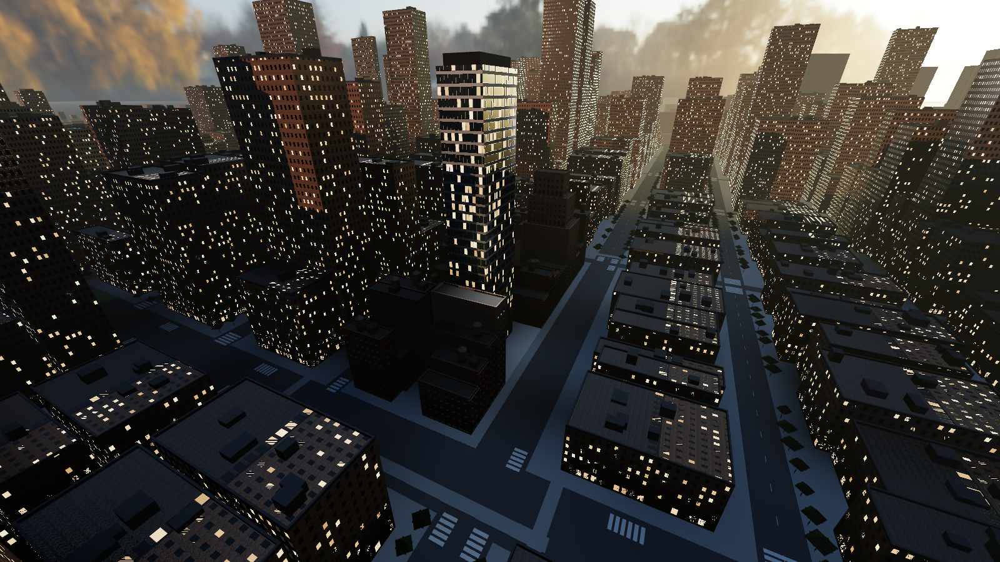

# plat

A commercial real estate simulation under a procedurally generated city,
rendered with Godot 4 (Forward+, Vulkan). Read `BRIEF.md` for what this is and
why, and `CLAUDE.md` for the working rules. Both predate the code and are
binding.

## Milestone 1 — one block, fully dressed

One seeded city block of ~35 procedurally generated buildings spanning three
zoning eras — pre-1916 lot-line lofts, 1916 setback towers stepped inside the
sky-exposure plane, and a 1961 tower-in-plaza — on the same street, under a
real computed sun, shot by a free-flow camera (continuous pitch and zoom;
optional near/mid/far presets).



Nothing in the scene is hand-placed: `BlockGen` subdivides the block into lots
and assigns eras, `Grammar` turns each lot into massing + facade parameters by
era rule, `MeshBuilder` turns those into meshes. Windows are dimensional
arithmetic in a shader (floors × bays at stated sizes), not a texture.

## Playing it

On a machine with a GPU:

```sh
git clone <this repo> && cd plat
bash tools/fetch-assets.sh     # pinned CC0 materials + sky (never committed)
godot --path .                 # or: open the folder in the Godot 4.5 editor, press F5
```

Godot 4.5 is the only dependency ([download](https://godotengine.org/download));
`tools/setup-linux.sh` installs it plus the software-Vulkan stack if you also
want headless renders on a machine without a GPU.

| input | does |
|---|---|
| left-drag | grab the ground and pan — the city slides with the cursor |
| right-drag or ctrl+left-drag | rotate bearing (x) and tilt pitch (y) |
| wheel | zoom toward the cursor |
| double-click | zoom in toward the click |
| arrows | pan |
| shift+arrows | rotate / tilt |
| compass (bottom-right) | reset bearing to north; +/− zoom |
| `V` | free-fly: WASD + RMB look + Q/E (or PgUp/PgDn) vertical |
| `C` | re-centre on downtown |
| `1` `2` `3` | optional near / mid / far presets (not a clamp) |
| `T` / `G` | time of day (rebuilds; sun and lit windows follow) |
| `N` | **new city** — fresh random seed, whole island regenerates |
| `F` | cycle the three preset framings |
| `R` rebuild, `H` help, `F12` screenshot, `Esc` quit |

The HUD shows live camera state and the city's plan line — seed, palette
family, height mode, era bias, island/islet count, district mix — so a city
you like can be reproduced exactly from its seed. Generating a city is
1–3 seconds of single-threaded work; the HUD says so while it runs.

The camera is **free-flow** (owner override): continuous pitch and zoom, no
height-band clamp, plus a WASD free-fly. Street-level fidelity is not a goal.
`data/camera_bands.json` remains only as optional presets. See `CLAUDE.md`.

## The economy

The simulation lives in its own repository —
[plat-econ](https://github.com/allpro244/plat-econ), the Broadway-and-Wall
engine ported headless, its gate harnesses green in CI — and the two meet
through one file (`docs/ECONOMY-ADAPTER.md`):

```sh
# in plat-econ: a whole city from a seed, quantities only
node tools/export-city.mjs --seed=1928 --out=city.json   # --density=landing…metropolis

# in plat: render it, or play it
tools/shoot.sh --city=city.json
godot --path . -- --city=city.json
```

The engine decides the coast, parcels, classes, years and heights; plat
decides what that looks like — eras from `yearBuilt`, curtain wall vs masonry
from class, palettes by district, the engine's own trees, crosswalks and
parks. Seeded plat cities (no `--city`) remain the renderer's own testbed.

## Rendering headless

```sh
tools/setup-linux.sh     # Godot 4.5 + lavapipe + Xvfb (one-time; no GPU needed)
tools/fetch-assets.sh    # pinned CC0 assets (Poly Haven / mirrors), gitignored
tools/shoot.sh           # headless render -> renders/shot.png
tools/shoot.sh --check   # renders twice, fails unless byte-identical
tools/shoot.sh --seed=7 --time=7.25 --band=mid --az=140  # any parameter varies
godot --path . -- --selftest   # drives the playable scene, saves a frame, quits
```

Every shot prints its full parameter line (seed, date, time, computed sun
azimuth/elevation, camera band/position) so any image is reproducible.

## Layout

| path | what |
|---|---|
| `data/camera_bands.json` | optional near/mid/far framing presets (not a clamp) |
| `src/camera_rig.gd` | free-flow rig: map orbit (bearing/pitch/distance) + fly mode |
| `src/sun_position.gd` | solar ephemeris (NOAA low-precision) — date+time+place → az/el |
| `src/city/block_gen.gd` | seeded lot subdivision + era assignment (quantities) |
| `src/city/grammar.gd` | era shape rules: lot → massing + facade params (form) |
| `src/city/mesh_builder.gd` | massing → ArrayMesh surfaces + roof props |
| `src/city/facade.gdshader` | dimensional window grid over the scanned wall set |
| `src/city_scene.gd` | assembles env/sky/sun/ground/block/camera from params |
| `src/shoot.gd` | headless entry: build, settle, save PNG, print params, quit |
| `tools/` | setup, pinned asset fetch, headless shoot |

## Notes for this environment

Headless rendering uses the real Forward+/Vulkan renderer through lavapipe
(software Vulkan) under Xvfb. Godot's `--headless` flag would swap in the
dummy renderer — `tools/shoot.sh` uses Xvfb precisely to avoid that.

The asset script prefers first-party Poly Haven URLs and falls back to pinned
GitHub mirrors of the same CC0 scan data when only github.com is reachable
(the case in the sandbox this was built in). **Both profiles serve the same
sky** — `spruit_sunrise`, at 4k from Poly Haven or 1k from the mirror — so the
picture cannot silently depend on which network built it. A panorama's sun
elevation is baked in and cannot be rotated away, so the scene's default time
of day (19:40 EDT, 21 June) is the time at which the computed solar elevation
for this latitude matches the sky's measured 7.7°. `CityScene` measures the
sky's sun at load and warns if the two disagree by more than 8°; every shot
prints the delta as `sky_delta`.

The profiles still differ in one respect: the mirror brick set has
albedo/normal/AO but no per-pixel roughness scan, so masonry there uses a
scalar roughness — brick is uniformly matte, so that is a material fact, not
a look tweak.
